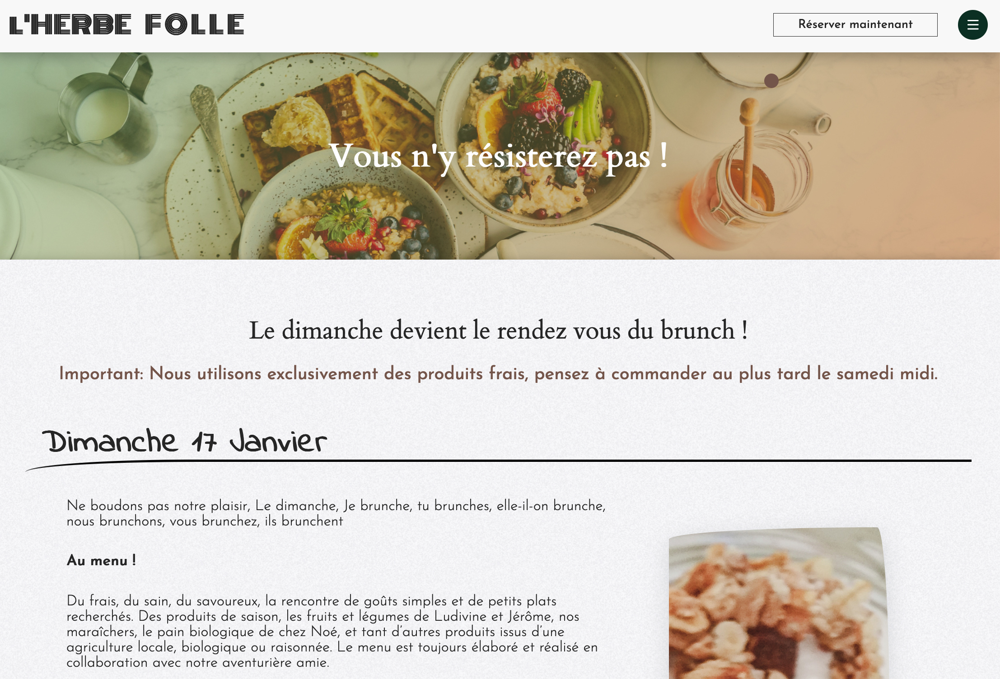

# 
# l'HERBE FOLLE - http://www.lherbefolle.net
## MY FIRST CUSTOM WORDPRESS THEME, MADE FROM SCRATCH . 
<table>
<tr>
<td>
  
  L'herbe Folle is a restaurant based in Aix en Provence, France. 
  The existing website was based on Wordpress, with a basic theme downloaded from the Wordpress theme gallery (Rinzai). Not really fancy and seen a thousand times. 
  During May 2021, I've completely redesigned the website and added more impacting content and learned how to make my first custom Wordpress theme from scratch. 
</td>
</tr>
</table>

## KEYPOINTS
________________________________________________________________
- Content and flat design made from scratch (HTML, CSS, Javascript)
- Fully responsive
- 6 pages, including 3 with dynamic content. 
- Page transition animation
- GSAP animated, with Scroll triggered and parallax effects on 2 pages. 
## THE WEBSITE (6 pages)
### 🔖 The Landing Page (static)
________________________________________________________________
Fully responsive, with hover effects displaying titles above images. Content animation done during page load with GSAP. Fixed footer appearing below the main content. 

&nbsp;

### 🔖 THE MENU (dynamic)
________________________________________________________________
- Responsive
- Customizable in the Wordpress admin console. 
- Custom burger icon changing shape when clicked. 
- Hidden by default, animated when clicking the burger icon
- Hover effects on links. 
- Dynamic PHP link to the latest post in a category. 

&nbsp;

&nbsp;

### 🔖 THIS WEEK PAGE (dynamic)
________________________________________________________________

- Fully responsive, with a different design for phone screen sizes. 
- Content animation with GSAP on page load. 
- Dynamic content displaying the content in the given Post category. 

&nbsp;

&nbsp;

### 🔖 THE ARCHIVE PAGE (dynamic)
________________________________________________________________
The Archive page displays all past posts in the MENU category. 

- Fully responsive
- Page navigation buttons
- Card layout with hover effects. 
  

&nbsp;

&nbsp;

### 🔖 THE BRUNCH PAGE (dynamic)
The BRUNCH page displays the last post in the BRUNCH category. 

- Fully responsive
- Page navigation buttons to see older posts. 
- Content animation with GSAP on page load. 

&nbsp;

&nbsp;

### 🔖 THE ABOUT PAGE (static)
________________________________________________________________
The About page displays some basic information about the restaurant. 
Features I'm proud of : 
- Fully responsive
- Scoll-triggered Content animation with GSAP and ScrollMagic. 
- Typing effect on text, delayed to match the end of the page load animations. 

&nbsp;

&nbsp;

### 🔖 THE BUY PAGE (static)
________________________________________________________________
The Buy page displays some basic information for customers to make their oders. 
Features I'm proud of : 
- Fully responsive
- Scoll-triggered Content animation with GSAP and ScrollMagic. 

&nbsp;

&nbsp;

## Librairies used 
________________________________________________________________
- [GSAP](http://www.w3schools.com/jquery/jquery_ref_ajax.asp) - GSAP simplifies HTML document traversing, event handling, animating, and Ajax interactions for rapid web development.
- [FontAwesome](https://developers.google.com/chart/interactive/docs/quick_start) - For icons.
plugins.

## To-do
________________________________________________________________
- Content optimization for faster page loads 
- Page animation to improve (tricky with wordpress)
- Dark mode ready
- Online store and payment (if needed by the client in the future). 

 © [Nicolas HODEE 2021](https://www.nicolashodee.com/)

